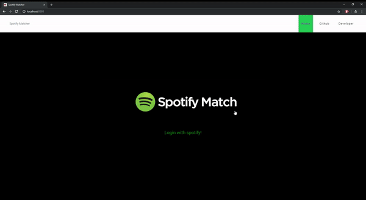

# Spotify Matcher Beta v0.1

Spotify Matcher is an application that shows you your favorite artists and their top tracks on Spotify. The goals aims to save those informations on a cloud database on firebase and use them to find your Spotify Match with the same music taste!

## Getting Started

These instructions will get you a copy of the project up and running on your local machine for development and testing purposes. See deployment for notes on how to deploy the project on a live system.

### Prerequisites

You have installed: npm, angular
You understand the basics of: Git, Node, Express, REST APIs, Promises, angular
You have a Spotify Account :)

Before doing anything you should check the auth flow of Spotify


for more info: https://developer.spotify.com/documentation/general/guides/authorization-guide/


In order to use this app you need to fork this repo: https://github.com/spotify/web-api-auth-examples 

and edit the following code in authorization_code/app.js


var client_id = 'CLIENT_ID'; // Your client id
var client_secret = 'CLIENT_SECRET'; // Your secret
var redirect_uri = 'REDIRECT_URI'; // Your redirect uri


and run the authorization_code

```
node authorization_code/app.js
```

Note: The token will expire after 60 minutes. 


### Installing

first install dependencies

```
npm install
```

And then

```
ng serve
```

The App looks like this:



## Running the tests

Explain how to run the automated tests for this system

### Break down into end to end tests

Explain what these tests test and why

```
Give an example
```


## Deployment TODO:

If I find time I will add the backend part to heroku so you will just clone this repo and then you can getting started

## Built With

* [Angular](https://angular.io/) - The js framework used
* [node](https://nodejs.org/en/) - Backend

## Contributing

Feel free to contribute


## Authors

* **Ugur Köysüren** - - [ugurkoysuren](https://github.com/ugurkoysuren)


## License

This project is licensed under theGNU General Public License v3.0 - see the [LICENSE.md](LICENSE.md) file for details

